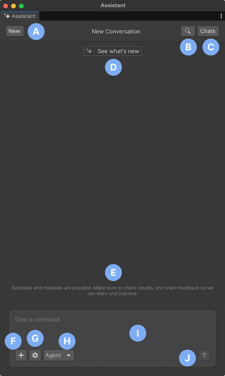

# Assistant interface

This section provides a detailed tour of Assistant.

| Component | Description |
| --------- | ----------- |
| **A**: **New** | Start a new conversation with Assistant or reset the current chat context. |
| **B**: Search (magnifying glass) | Search across the current Assistant conversation to quickly find previous prompts and responses. |
| **C**: **Chats** | Refer to your previous interactions within Assistant. Review and reuse previous information without having to retype or recall past conversations. |
| **D**: **See what’s new** | Open the latest updates and release highlights for Assistant. |
| **E**: Conversation area | Displays your prompts, Assistant responses, **Reasoning** section, and tool results. |
| **F**: Attach (**+**) | Attach GameObjects, assets, scripts, Console messages, screenshots, and other supported project data to your prompt. |
| **G**: **Settings** menu (gear icon) | Open the prompt settings menu, where you can enable **Autorun**, enable or disable **Collapse Reasoning when complete**, view **Permission Overrides**, open **Assistant Settings**, or refresh the project overview. |
| **H**: Mode selector (**Ask**/**Agent)** | Change between the **Ask** mode (read-only guidance) and the **Agent** mode (actions in your project). |
| **I**: Text field | Enter your queries. Queries are the primary interaction point for communication with Assistant. By typing in questions, instructions, or topics of interest, you start the conversation and receive relevant responses from Assistant.  |
| **J**: Submit (arrow) | Send your prompts to Assistant. |

## Additional resources

* [Assistant permissions and preferences](xref:assistant-preferences)
* [Best practices for using Assistant](xref:assistant-best)