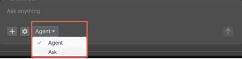

# Assistant Ask and Agent modes

Understand how the **Ask** and **Agent** modes change the way Assistant responds to your prompts and acts in your project.

Assistant supports two interaction modes that align with different workflows. The **Ask** mode provides guidance and analysis without changing your project. The **Agent** mode performs actions in your project, such as creating objects or modifying assets. Choose the appropriate mode to control whether Assistant only advises you or also acts on your behalf.

Use the **Ask** mode for questions, learning, and review. Use the **Agent** mode when you want Assistant to apply changes directly in the Unity Editor.

To access and change between modes:

- In the Assistant window, locate the mode selector in the text field.
- Select **Ask** or **Agent** from the menu.

The selected mode applies to your next prompt. You can change modes at any time.

## Ask and Agent mode comparison

The following table compares the key differences between the **Ask** mode and **Agent** mode.

| Feature                   | Ask mode                                         | Agent mode                               |
| ------------------------- | ------------------------------------------------ | ---------------------------------------- |
| Primary purpose           | Provide explanations and guidance                | Perform actions in the project           |
| Modifies scenes or assets | No                                               | Yes                                      |
| Tool access               | Read-only tools only                             | Read and write tools                     |
| Permission prompts        | Not required for read actions                    | Required based on permission settings    |
| Best for                  | Learning, reviewing, planning                       | Setup, fixes, automation                 |
| Example prompt            | `What is a good light intensity for this scene?` | `Fix the light intensity in this scene.` |

## Ask mode

Use the **Ask** mode for questions and explanations. In this mode, Assistant:

- Answers questions in text.
- Suggests code, settings, and best practices.
- Uses read-only tools to inspect your project.
- Doesn't call tools that modify your scene or assets.

The **Ask** mode doesn't perform write operations, so it doesn't request confirmation to make changes. However, it still respects your read permissions. If read access to a specific operation is blocked in your [permission settings](xref:preferences#enable-auto-run), Assistant can't inspect that information.

For example, in the **Ask** mode:

- `How should I create a cube for this scene?`: Assistant describes the steps or shows example code, but doesn't create the cube.
- `What is a good light intensity for this scene?`: Assistant reads the current scene data and suggests settings without changing values.

## Agent mode

Use the **Agent** mode to perform actions in your project. In this mode, Assistant:

- Calls tools that can create, modify, or delete objects.
- Uses your permission settings to decide when to prompt for confirmation.
- Combines reasoning and tool calls to complete multi-step tasks.

For example, in the **Agent** mode:

- `Create a cube in my scene.`: Assistant calls a tool, such as `Create GameObject`, asks for permission if required, and creates the cube.
- `Fix the light intensity in this scene.`: Assistant reads the scene data, then calls tools to adjust lights if you grant permission.

The **Agent** mode still answers questions with text only, especially when no action is required. However, it always has access to a broader set of tools than the **Ask** mode, and acts when your prompt implies a change.

If you're unsure, start in the **Ask** mode. You can change to the **Agent** mode when you're ready for Assistant to modify your project, and you can rely on permission prompts to confirm sensitive operations.

## Additional resources

* [Image support](xref:image-support)
* [Assistant tools](xref:assistant-tools)