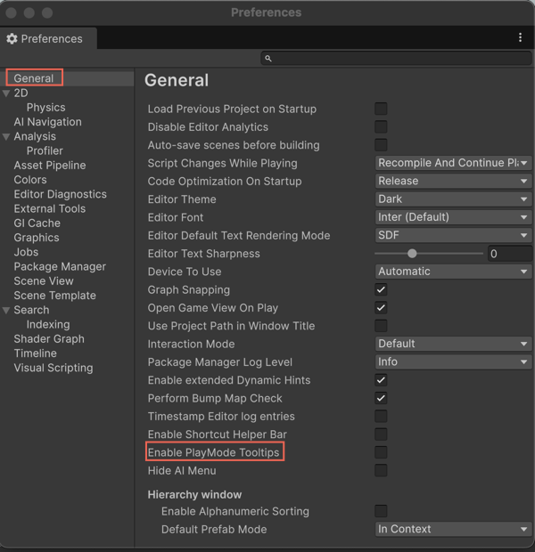

# Enable tooltips in Play mode

Enable Assistant tooltips in Play mode so you can continue to view contextual guidance while testing your project.

If you're in Play mode and don't find Assistant tooltips, you must enable this setting in **Preferences**. This ensures that tooltips remain visible during runtime for debugging, testing, and iteration.

To configure this setting, follow these steps:

1. In the Unity Editor, do one of the following depending on your platform:

   * **Windows**: Select **Edit** > **Preferences** > **General** > **Enable PlayMode Tooltips**.

   * **macOS**: Select **Unity** > **Settings** > **General** > **Enable PlayMode Tooltips**.

2. Select **Enable PlayMode Tooltips**.

   

After you enable this option, Assistant tooltips appear even when in Play mode.

## Additional resources

* [Install Assistant with the Package Manager](xref:install-assistant)
* [Get started with Assistant](xref:get-started)
