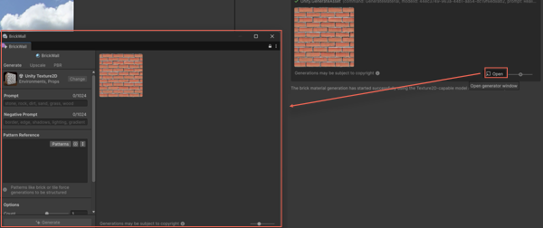

# Create assets with Assistant

Generate artificial intelligence (AI)-powered assets directly from Assistant without leaving the Unity Editor.

Assistant can access Unity Generators through natural language commands. When you describe the type of asset you want to create, Assistant analyzes the requirements and generates the asset using the relevant models. The generated asset is saved in the `Assets` folder and appears in the Generations panel in the Assistant window.

## Generate assets from Assistant

To create assets with Assistant, follow these steps:

1. Open Assistant in the Unity Editor.
2. In the text field, enter a prompt that describes what you want to generate. For example, `Generate a cubemap of sunset over mountains`.

   > [!NOTE]
   > Use clear and descriptive prompts for best results. Include material type, lighting, and visual style. For example, `bright hand-painted forest texture` or `realistic brushed metal surface`.

3. Press the **Enter** key or select the send icon to submit your query.
4. Assistant analyzes your request and displays the generated assets in the Generations panel of the Assistant window.

   Each asset preview includes an **Open** button to refine or regenerate the asset in the Generator window.

5. When you select an asset, it's highlighted in the **Project** window.
6. To use an asset, apply it in your scene like any other assets.

## Refine or regenerate assets

To refine an asset using the corresponding Generator window, follow these steps:

1. Select the generated asset in the **Project** window.
2. Do one of the following:

   * Right-click the asset and select **Generate**.
   * In the **Inspector** window, select **Generate**.

      The Generator window opens with the pre-filled Assistant settings.
3. Review the rewritten prompt and any pre-filled options.
4. Adjust model selection, resolution, or reference images as needed.
5. To manage the generated asset, right-click it to view the following options:

   * Select
   * Promote to current asset
   * Promote to new asset
   * Show in Explorer
   * Show Generation Data

   For more information, refer to [Manage generated sprites](xref:manage-sprite).
6. Select **Generate** to create an updated version of the asset.

   > [!TIP]
   > You can also select **Open** in the generated asset preview in Assistant to open the corresponding Generator window.
      

## Additional resources

- [Asset generation in Assistant](xref:integration)
- [About Generators](https://docs.unity3d.com/Packages/com.unity.ai.generators@latest)