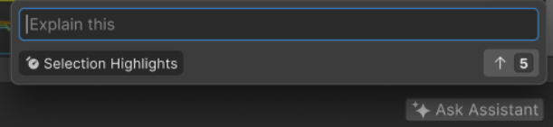
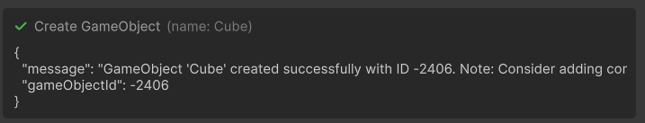

# AI Assistant Integration Onboarding

Welcome! This guide will help your team integrate AI capabilities into your Unity package using the AI Assistant framework.

## Getting Started

### API Sample

A good place to start is checking out our [API Sample](SAMPLE.md).

To try this example, you will have to make sure your Player Settings define the `ASSISTANT_INTERNAL` symbol.
The sample will then be available through the `AI Assistant > Internals > API Sample` menu in the Editor.

You can check out our included `Test Project` to try this out.

### Repository & Key Resources

- [Main Repository (this one)](../../../../../../) 
- [AI Assistant API](../../../../../com.unity.ai.assistant/Editor/Assistant/Api)
- [Integrations Folder](../../../../../com.unity.ai.assistant/Editor/Assistant/Integrations)
- [API Sample](../../../../../com.unity.ai.assistant/Editor/Assistant/Integrations/Sample)
- [Test Project](../../../../../../Projects/TestProject)

## Creating Your Integration

### 1. Set Up Your Integration Assembly

1. Copy the [Sample Integration](../../../../../com.unity.ai.assistant/Editor/Assistant/Integrations/Sample) from the Integrations folder as a starting point
2. Rename the folder and files to match your package (e.g., Profiler, 2D)
3. Configure your `.asmdef` file with appropriate name and references
4. Add internal visibility by modifying `AssemblyInfo.cs` to include your assembly in the following assemblies:
   - `Packages/com.unity.ai.assistant/Editor/Assistant/Api/AssemblyInfo.cs`
   - `Packages/com.unity.ai.assistant/Editor/Assistant/AssemblyInfo.cs`
   - `Packages/com.unity.ai.assistant/Editor/Tools/AssemblyInfo.cs`
   - `Packages/com.unity.ai.assistant/Runtime/AssemblyInfo.cs`

```csharp
[assembly: InternalsVisibleTo("Unity.AI.Assistant.Integrations.Sample.Editor")]
```
> **Note:** In the line above, replace `Unity.AI.Assistant.Integrations.Sample.Editor` with your assembly name.

## Building Your Agent

### 2. Create Your Custom Agent

Define an agent tailored to your domain using the fluent API:

```csharp
static IAgent CreateMyCustomAgent()
{
    var agent = new LlmAgent()
        .WithId("unity_profiler")
        .WithName("Profiling Agent")
        .WithDescription("Specialized agent for analyzing Unity performance and profiling data, such as memory usage, expensive calls, etc.")
        .WithSystemPrompt(@"
    You are a Unity performance profiling expert. Your role is to:
    1. Analyze performance data and identify bottlenecks
    2. Provide actionable optimization recommendations
    3. Explain performance metrics in clear, developer-friendly terms
    4. Focus on Unity-specific performance considerations
    5. Do not ask the user for more information.

    Always base your analysis on the provided profiling data and use the available tools to gather additional information when needed.
    In your final answer, when you mention a specific profiler data frame, always mention it as a url with the following format:
    [Frame 17](profiler://frame/17) where 17 here is the frame index.
")
        .WithToolsFrom<MyProfilingTools>()
        .WithToolsFrom<AdditionalTools>();
    
    return agent;
}
```

**Key Components:**

- **Id:** Unique identifier for your agent (no spaces, only alphanumeric characters and underscores)
- **Name:** User-facing name displayed in the UI
- **Description:** Explains the agent's purpose and capabilities. This is used by the orchestration system to pick the best agent for a user request so it should be a good balance of generic and precise.
- **SystemPrompt:** Defines the agent's behavior, expertise, and constraints. This is where you can give instructions specific to your domain so that the agent can better perform its task.
- **Tools:** Custom functions your agent can call to interact with your package/domain.

### 3. Define Your Tools

Tools are static C# methods that your agent can call to interact with your package or perform specific tasks. Use the `[AgentTool]` attribute to expose methods to your agent. Both synchronous and asynchronous methods are supported.

```csharp
[AgentTool(
    "Get current project settings and configuration.",
    "Unity.Sample.GetProjectSettings",
    assistantMode: AssistantMode.Agent | AssistantMode.Ask)]
public static string GetProjectSettings()
{
    // Here make a call to your API
    return "Project configuration data";
}
```

**Tool Parameters:**

- **description:** Clear explanation of what the tool does - helps the agent decide when to use it. Description should avoid mentioning specific parameters, other tools, other agents, implementation details or be goal oriented. Just describe what the tool does.
- **id:** Unique identifier for the tool. This ID should be made of at least 3 dot-separated parts, the first one being "Unity" and the second the domain of the tool, like "Unity.GameObject.Create"
- **toolCallEnvironment:** Specifies when the tool is available:
  - `Runtime`: Available in Unity Runtime (no Editor present)
  - `PlayMode`: Available in Unity's Play Mode
  - `EditMode`: Available in Unity's Edit Mode
  - Can be combined: `ToolCallEnvironment.EditMode | ToolCallEnvironment.PlayMode`
- **assistantMode:** Specifies which assistant modes can use this tool:
  - `AssistantMode.Agent`: For any tool, including tools that modify objects or data, or that only do read-only operations.
  - `AssistantMode.Ask`: For tools that only perform read-only operations
  - Can be combined: `AssistantMode.Agent | AssistantMode.Ask`
  - A read-only tool is expected to be available in both modes, except if there is a specific variant of this tool for the Agent mode: `AssistantMode.Agent | AssistantMode.Ask`
- **tags** (optional): Never define tags if your tool is made for a custom agent only. Otherwise tags are used to assign tools to specific existing agents.

**Method Requirements:**

> **Important:** You should read our [tool guidelines](TOOL_GUIDELINES.md) to better implement your tools.

- Must be a static method with the `[AgentTool]` attribute
- Each parameter must have a `[Parameter]` attribute describing what the parameter does, its default values, and example for complex parameters.
- First parameter can optionally be `ToolExecutionContext` to receive execution context (not sent to LLM). In this case, your tool should most likely be async. Use this context when:
  - Your tool create / delete / modify objects, data or files: you will need to call the Permissions checks from the context, and record file operation through the Undo context.
  - You need to display a custom UX to get user input during the tool execution
- **Return type:** any type that can be serialized to JSON

## Using the API

### 4. One-Shot Headless Execution

Run your agent programmatically without UI and async, in a one-shot fashion. This will not use the orchestration system nor the other agents, only your custom agent:

```csharp
static async Task<string> RunAgentHeadless()
{
    var agent = CreateMyCustomAgent();
    var prompt = "How do I optimize my workflow?";
    var output = await agent.Run(prompt);
    
    // Retrieve the final response, excluding the reasoning steps
    var lastBlock = output.Message.Blocks[^1] as ResponseBlock;
    return lastBlock.Content;
}
```

**Use Cases:** Automation, testing, background processing

### 5. UI Integration & Agent Registration

Launch your agent with the Assistant UI. This will run the normal Assistant, including the full orchestration system and all other existing agents. This also means the user will be able to resume the discussion, asking follow-up questions or make requests that might require other agents.

> **Note:** For your agent to be used, this means you must first register your agent as part of the orchestration system. Once registered, the Assistant can automatically select and use your agent based on user prompts and context.

First, register your agent with the orchestration system:

```csharp
[InitializeOnLoadMethod]
static void RegisterMyAgent()
{
    var agent = CreateMyCustomAgent();
    AgentRegistry.RegisterAgent(agent, AssistantMode.Any);
}
```

> **Note:** Typically, you should have your agent be always registered, including after domain reload so that it can be used directly from the Assistant window. We strongly recommend registering your agent in a static method flagged with the `[InitializeOnLoadMethod]` attribute.

Then run the Assistant with UI:

```csharp
static async Task<string> RunAgentWithUI()
{
    var prompt = "How do I optimize my workflow?";
    var output = await AssistantApi.RunWithUI(prompt, assistantMode: AssistantMode.Agent);
    
    // Retrieve the final response, excluding the reasoning steps
    var lastBlock = output.Message.Blocks[^1] as ResponseBlock;
    return lastBlock.Content;
}
```

**Use Cases:** Interactive workflows, user-facing features, debugging assistance

### 6. Embedded UI with PromptThenRun

Integrate the Assistant UI directly into your package. This shows a prompt popup near your UI element, then displays the Assistant chat when the user submits:



```csharp
// Call from your package UI
await AssistantApi.PromptThenRun(
    anchorElement: myVisualElement,  // Your UI element to anchor the prompt near
    assistantMode: AssistantMode.Agent
);
```

The popup appears above or below the specified VisualElement, allowing users to enter a prompt directly within your package's UI. Once submitted, the full Assistant interface takes over to process the request.

**Use Cases:** Contextual AI assistance within your editor windows, quick access to agent capabilities without leaving your workflow

### 7. Attaching Custom Data

Attach custom data (aka "context") that will be given to the Assistant as additional info with the user prompt.

You must first create a context object:

```csharp
var attachedContext = new AssistantApi.AttachedContext();
```

Then you can attach one or multiple Unity.Object like so:

```csharp
attachedContext.Objects.Add(myGameObject);
attachedContext.Objects.Add(someTextureAsset);
attachedContext.Objects.Add(someSceneComponent);
```

Or even define custom attachments:

```csharp
var attachment = new VirtualAttachment("Some payload data", "Custom Type Name", "A name", someMetadataObject);
attachedContext.VirtualAttachments.Add(attachment);
```

Finally, you can specify this context data when using any of the available run APIs (headless, UI or with Embedded UI):

```csharp
output = await agent.Run(prompt, attachedContext: attachedContext);
output = await AssistantApi.RunWithUI(prompt, attachedContext: attachedContext);
output = await AssistantApi.PromptThenRun(prompt, attachedContext: attachedContext);
```

**Use Cases:** Adding extra info to the request, specifying request context

## Customizing the UI

### 8. Custom Function Call Renderers

Customize how your tool calls appear in the Assistant chat view by creating custom renderers. By default, tool calls display with a title and parameters:


When expanded, they show the content returned by the tool:



**What You Can Customize:**

- **Title:** Change how the tool invocation is labeled
- **Parameters:** Customize how input parameters are displayed
- **Content:** Render the tool's output with any VisualElement you want

**Basic Example:**

```csharp
[FunctionCallRenderer(typeof(ProjectTools), nameof(ProjectTools.GetSettings))]
class GetProjectSettingsFunctionCallRenderer : DefaultFunctionCallRenderer
{
    // Customize the title
    public override string Title => "Getting Project Settings";

    // Customize the parameter display
    public override string TitleDetails => "";

    // Customize the display when the tool is called
    public override void OnCallRequest(AssistantFunctionCall functionCall)
    {
        // Do any update that might require the tool call parameters
    }
    
    // Customize the display when the tool call successfully completed
    public override void OnCallSuccess(string functionId, Guid callId, IFunctionCaller.CallResult result)
    {
        // Custom content rendering
        var container = new VisualElement();
        container.AddToClassList("project-settings-result");
        
        var label = new Label("Project Configuration:");
        label.AddToClassList("settings-header");
        container.Add(label);
        
        var contentLabel = new Label(result.Result);
        contentLabel.AddToClassList("settings-content");
        container.Add(contentLabel);
        
        Add(container);
    }
    
    // Customize the display when the tool call failed
    public override void OnCallError(string functionId, Guid callId, string error)
    {
        var errorLabel = new Label($"Failed to retrieve settings: {error}");
        errorLabel.AddToClassList("error-message");
        Add(errorLabel);
    }
}
```

Custom renderers allow you to:

- Provide clearer, user-friendly labels for tool invocations
- Format complex data structures in a readable way
- Add custom styling, icons, or visual elements
- Create interactive displays (buttons, links, formatted tables, etc.). Note that these interactive elements will not impact the tool call itself. There is another mechanism for that.
- Give users better context about what the agent is doing

You have full control over the rendering using Unity's UI Toolkit - any VisualElement can be used to display your tool's results.

### 9. Custom Interactions

Create interactive UI elements that appear in the chat during a tool call, to wait for a user or input.

First define the interaction class, which specifies the interaction return type and the UX:

```csharp
class PickSessionInteraction : BaseInteraction<SessionProvider.ProfilerSessionInfo>
{
    public PickSessionInteraction(List<SessionProvider.ProfilerSessionInfo> sessions)
    {
        // Build your custom UI
        foreach (var session in sessions)
        {
            var button = new Button(() => CompleteInteraction(session))
            {
                text = "Select"
            };
            Add(button);
        }
    }
}
```

Then use the interaction from within a tool. Your tool must be async and passed the ToolExecutionContext parameter:

```csharp
[AgentTool("Let the user pick a profiling session", id: "Unity.Profiler.PickSession", assistantMode: AssistantMode.Agent | AssistantMode.Ask)]
public static async Task<string> PickSession(ToolExecutionContext context)
{
    var profilingSessions = await SessionProvider.GetProfilingSessions(context);
    
    // Create the interaction element and wait for the user interaction            
    var pickSessionInteraction = new PickSessionInteraction(profilingSessions);
    var selectedSession = await context.Interactions.WaitForUser(pickSessionInteraction);
    
    return selectedSession.Path;
}
```

**Example:** PickSessionInteraction.cs

Custom interactions enable:

- Rich selection interfaces (file pickers, option lists, etc.)
- Interactive workflows where the agent needs user input mid-conversation
- Domain-specific UI components tailored to your package

### 10. Custom Link Handlers

Define the behavior when the user clicks on specific links in the Assistant answer.

The following would handle any link starting with "profiler://":

```csharp
[LinkHandler("profiler")]
public class SampleLinkHandler : ILinkHandler
{
    public void Handle(string prefix, string url)
    {
        Debug.Log($"[SAMPLE] Clicked link: '{url}' with prefix '{prefix}'");
    }
}
```

Custom link handlers enable:

- Performing custom action when a link is clicked
- Providing extra data for the action as part of the url parameters

## Next Steps

1. **Define Your Tools and Agent:** Create the functions your agent needs to interact with your package (see existing integrations for examples)
2. **Craft Your System Prompt:** Write clear instructions for your agent's behavior and expertise
3. **Test Iteratively:** Start with mocked tools if APIs aren't ready, then integrate real functionality
4. **Customize the UI:** Add custom renderers and interactions to enhance the user experience
5. **Collaborate with Us:** Reach out to the AI Assistant team for technical guidance, API support, and best practices

## Need Help?

Contact the AI Assistant team for:

- Technical guidance and API support
- Help with agent design and tool definitions
- Custom UX components for your integration
- Unblocking technical hurdles

We're here to help you build great AI-powered experiences for your users!