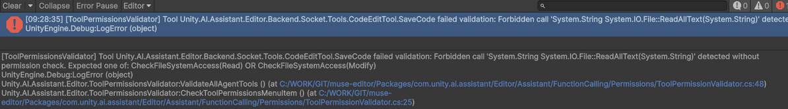
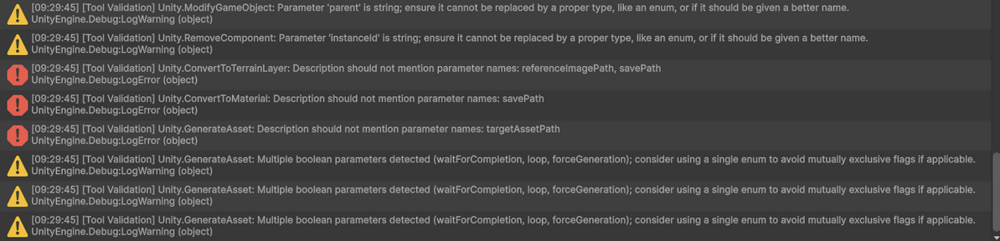
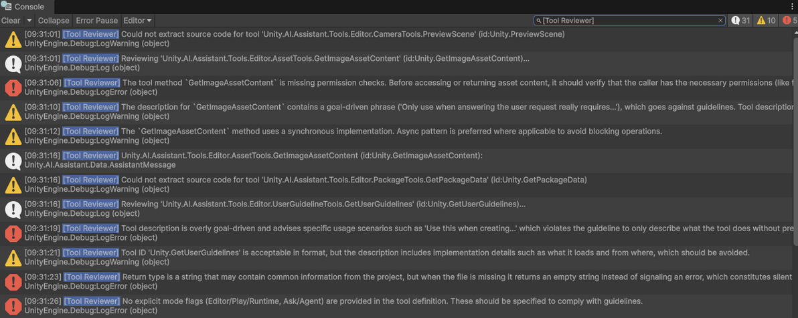

# Tool Guidelines

## Introduction

The following document introduces a set of guidelines that developers should follow when implementing tools.

## Automatic validation

Several tools have been developed to help you automatically identify issues with tools. All tools can be found under the internal AI Assistant menu in the Editor, under:

**AI Assistant > Internals > Tool**

### Permissions (fast)

The **Check Permissions** tool applies heuristics to check if the proper permissions have been implemented in your tools.
It does not cover all possible cases but should catch most of them. It also focuses on the most important permissions (reading is typically ignored).

> Note: This tool, unlike others, is automatically run on domain reload as proper permission implementation is critical.

The console log will give information about the failing tool and which permission(s) are missing.

### Definitions (fast)

The **Check Definitions** tool applies heuristics to check some basic rules for tool definitions, such as tool ID format.

### Deep Review (slow)

The **Review** tool uses our agent API to analyze the tool code with an LLM and check if it follows the guidelines.
This is the most informative tool but also the slowest.

Because running this tool can be verbose, it is recommended to filter logs to only those containing `[Tool Reviewer]`:

---

## Guidelines and Covered Checks

Below is a table summarizing tool guidelines and the areas covered by fast heuristic tools.
The slow reviewer tool attempts to cover all guidelines, but manual inspection is still required.

| Symbol | Meaning                              |
| ------ | ------------------------------------ |
| ❌      | Not covered by validation tool       |
| ⚠️     | Partially covered by validation tool |
| ✅      | Fully covered by validation tool     |

---

## Tool Definition

| Guideline                                                                      | Validation Status | Notes                                             |
| ------------------------------------------------------------------------------ | ----------------- | ------------------------------------------------- |
| **1.1 - Use the appropriate tag(s)**                                           | ❌                 | Code checks for `[AgentTool]` but not other tags. |
| **1.2 - Flag valid Editor / Play / Runtime mode(s)**                           | ❌                 | Not checked in code.                              |
| **1.3 - Flag valid Ask / Agent mode(s)**                                       | ❌                 | Not checked in code.                              |
| **1.4 - Avoid duplicating or (largely) overlapping features with other tools** | ❌                 | Not checked.                                      |

---

## Tool Description

| Guideline                                                    | Validation Status | Notes                                                         |
| ------------------------------------------------------------ | ----------------- | ------------------------------------------------------------- |
| **2.1 - Do not mention other tools**                         | ✅                 | Checks for `Unity.` in the description.                       |
| **2.2 - Do not mention specific agents (except rare cases)** | ❌                 | Not checked.                                                  |
| **2.3 - Do not mention specific parameters**                 | ⚠️                | Checks for uppercase parameter names; not single-word params. |
| **2.4 - Avoid goal-driven messages**                         | ❌                 | Not checked.                                                  |
| **2.5 - Do not describe internal implementation details**    | ❌                 | Not checked.                                                  |
| **2.6 - Clear, complete, concise**                           | ❌                 | Not checked.                                                  |

---

## Tool ID

| Guideline                                                 | Validation Status | Notes                         |
| --------------------------------------------------------- | ----------------- | ----------------------------- |
| **3.1 - Use Upper Camel Case with dot separators**        | ✅                 | Validates segment formatting. |
| **3.2 - Short, reflects tool action, aligned with Unity** | ❌                 | Not checked.                  |
| **3.3 - Must begin with `Unity.`**                        | ✅                 | Checked.                      |
| **3.4 - Must contain ≥3 dot-separated segments**          | ⚠️                | Checks segment count only.    |
| **3.5 - Not ambiguous / avoid generic names**             | ❌                 | Not checked.                  |

---

## Parameter Definition

| Guideline                                                    | Validation Status | Notes                                            |
| ------------------------------------------------------------ | ----------------- | ------------------------------------------------ |
| **4.1 - Use typed parameters (int, bool, enum) over string** | ✅                 | Warns for string params not in allowed keywords. |
| **4.2 - Avoid ambiguous or mutually exclusive parameters**   | ⚠️                | Warns if >2 bool parameters exist.               |
| **4.3 - Prefer required parameters over optional**           | ❌                 | Not checked.                                     |
| **4.4 - Explain default behavior for optional parameters**   | ❌                 | Not checked.                                     |
| **4.5 - Do not expose everything as a parameter**            | ❌                 | Not checked.                                     |
| **4.6 - Prefer single enum over multiple bool flags**        | ✅                 | Encouraged via bool warning.                     |

---

## Parameter Description

| Guideline                                          | Validation Status | Notes        |
| -------------------------------------------------- | ----------------- | ------------ |
| **5.1 - Clear and complete for simple parameters** | ❌                 | Not checked. |
| **5.2 - Provide examples for complex parameters**  | ❌                 | Not checked. |
| **5.3 - Document parameter constraints**           | ❌                 | Not checked. |

---

## Tool Implementation

| Guideline                                                                | Validation Status | Notes                                        |
| ------------------------------------------------------------------------ | ----------------- | -------------------------------------------- |
| **6.1 - Do not use generic Call method**                                 | ✅                 | Checked.                                     |
| **6.2 - Group related tools into a single non-static class**             | ❌                 | Not checked.                                 |
| **6.3 - Implement required permission checks**                           | ✅                 | Checked by Permission Validator.             |
| **6.4 - Declare created object through context for permission ignoring** | ❌                 | Not checked.                                 |
| **6.5 - Re-use / share code**                                            | ❌                 | Not checked.                                 |
| **6.6 - Implement pagination/resume for long results**                   | ❌                 | Not checked.                                 |
| **6.7 - Deterministic tool behavior**                                    | ❌                 | Not checked.                                 |
| **6.8 - Prefer async patterns**                                          | ✅                 | Checked when `ToolExecutionContext` is used. |
| **6.9 - Use internal logs for debugging only**                           | ❌                 | Not checked.                                 |
| **6.10 - Do not fail silently**                                          | ❌                 | Not checked.                                 |
| **6.11 - Errors should be understandable for an LLM**                    | ❌                 | Not checked.                                 |
| **6.12 - Follow Unity C# guidelines**                                    | ❌                 | Not checked.                                 |

---

## Return Type

| Guideline                                                     | Validation Status | Notes                                  |
| ------------------------------------------------------------- | ----------------- | -------------------------------------- |
| **7.1 - Avoid returning unnecessary messages**                | ❌                 | Not checked.                           |
| **7.2 - Avoid mentioning specific tools/agents in return**    | ❌                 | Not checked.                           |
| **7.3 - Do NOT return success/error flags; throw exceptions** | ✅                 | Checks for `Success` or `Error` props. |
| **7.4 - Returning void allowed**                              | ✅                 | Implicitly allowed.                    |
| **7.5 - Limit output size**                                   | ❌                 | Not checked.                           |
| **7.6 - Output should be easy for LLMs to consume**           | ❌                 | Not checked.                           |

